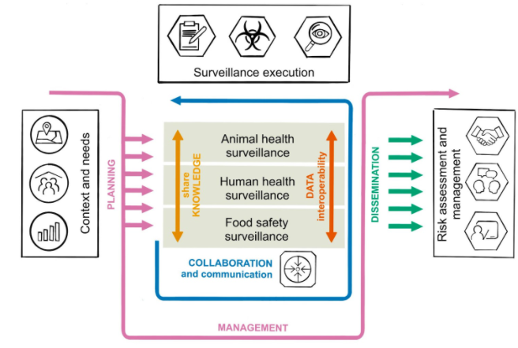
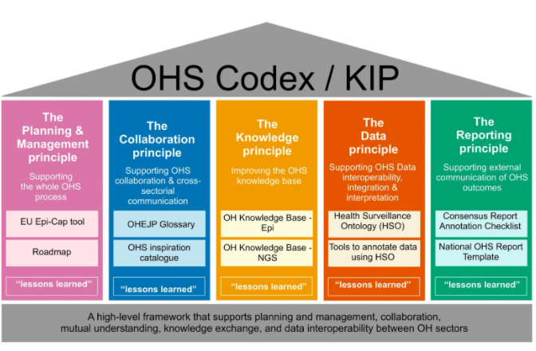

=========================
Introduction / Background
=========================

Zoonoses and antimicrobial resistance (AMR) continue to be significant
impediments to human and animal health and to socioeconomic development
worldwide [1]_, [2]_, [3]_. National and international surveillance
systems and monitoring programmes for zoonoses, zoonotic agents and AMR
are means to combat these impediments. It is generally recognized that
human and animal health are interconnected and that the transmission of
zoonoses and AMR can essentially take place through various links of the
human-animal interface e.g. the environment or food  [4]_, [5]_. This
implies that surveillance cannot be addressed by the human or animal
sector alone, but instead have to be a multisectoral and
multidisciplinary collaboration  [6]_. This approach to collaboration is
referred to as One Health. The benefits and importance of One Health
Surveillance (OHS) are widely accepted, however, there are still gaps in
surveillance or surveillance data that hinder a truly integrated OHS
approach.

Within the EU, EFSA and ECDC have made substantial efforts to harmonize
data collection and reporting within their sectors. These achievements
are important assets for future OHS harmonization efforts, for example
the Data Collection Framework
(`DCF <https://www.efsa.europa.eu/en/supporting/pub/en-444>`__\  [7]_)
and the SIGMA project
(`SIGMA <https://www.efsa.europa.eu/en/supporting/pub/en-1428>`__\  [8]_)
from EFSA, as well as the European Surveillance System
(`TESSy <https://ecdc.europa.eu/en/publications-data/european-surveillance-system-tessy>`__\  [9]_)
from ECDC. Other ongoing joint efforts of these stakeholders support OHS
data harmonization as well, for example the joint molecular typing
database [10]_. Another collaborative effort is the compilation of the
yearly European Summary Reports (EUSRs) on trends and sources of
zoonoses, zoonotic agents and food-borne outbreaks and on antimicrobial
resistance in zoonotic and indicator bacteria from humans, animals and
food (URL: https://www.efsa.europa.eu/en/publications). However, the
current practice of provisioning OHS data in reports could be improved,
specifically when it comes to national or research data not covered by
European legislation. Moreover, no generic strategy for surveillance
data reporting is currently available that could be adopted by all OHS
related scientific disciplines including e.g. environmental science.

The One Health EJP H2020 Joint Integrative Project (JIP) “One health 
suRveillance Initiative on harmOnization of data collection and 
interpretatioN” (ORION) aims at establishing and strengthening 
inter-institutional collaboration and transdisciplinary knowledge 
transfer in the area of One Health Surveillance (OHS) data integration 
and interpretation. Detailed requirement analyses were performed within 
ORION to identify current best practices, resources and needs within 
the OHS community [11]_. Results from the requirement analyses confirmed 
that cross-sectoral ande multi-disciplinary communication, collaboration 
and knowledge exchange are still significant challenges for the European 
OHS community. In addition, the results reinforced the need for better 
harmonization of reports on OHS data, which could ultimately lead to 
improved mutualnunderstanding and use of sector-specific data in 
future One Health analysis.

Another One Health EJP H2020 JIP currently in progress is called "MATRIX: Connecting
dimensions in One-Health surveillance", which aims to strengthen OHS
practices and synergies across the entire surveillance pipeline between
the public health (PH), animal health (AH) and food safety (FS) sectors
within each country (expected end in December 2022). MATRIX builds upon
the foundation laid out by ORION and other projects, while focusing on
cross-sectorial hazards (i.e. Salmonella, Campylobacter, Listeria, and
emerging threats, including antimicrobial resistance).

This OHS Codex/KIP therefore aims at establishing a high-level framework
that supports collaboration, mutual understanding, knowledge exchange,
data interoperability and coordination between OH sectors that will support
integrated OHS data analyses, data interpretation and OH decission making. 
A manuscript describing the practical application scenarios of the OHS 
Codex/KIP has been also published [12]_.

Purpose
-------

The purpose of this OHS Codex/KIP is to provide users with guidance and
resources, e.g. tools, technical solutions, guidance documents, that
support the design and planning of OH surveillance and monitoring activities 
as well as OH-driven data analysis and interpretation by the
different OHS sectors. With that, the OHS Codex/KIP supports the ambitions
outlined in chapter 3, 4, and 5 of the FAO, OIE and WHO
document ‘Taking a Multisectoral, One Health Approach: A Tripartite
Guide to Addressing Zoonotic Diseases in Countries” [13]_ (Tripartite
Guide) by proposing specific resources that support putting a true One
Health approach (as described in the Tripartite Guide) into practice in
Europe.

    Fig. 1: Connection between the Tripartite Guide and the five principles
    of the OHS Codex/KIP. The OHS Codex/KIP principles and their dimensions
    are indicated by coloured arrows. The icons correspond to the guiding
    icons from the Tripartite Guide.

Target community, main stakeholders and organizations
-----------------------------------------------------

According to the understanding of the authors elements of the OHS Codex/KIP
will be useful for

organizations or researchers that are involved in

-  One Health surveillance implementation

-  One Health surveillance data reporting

-  One Health data harmonization and standardization

-  Cross-sector risk management

Specifically, this includes

-  the One HEalth EJP H2020 project consortium and their follow up organization

-  national authorities in Europe involved in OHS

-  European authorities and institutes, as e.g. EFSA, ECDC, EEA

-  other stakeholders in OHS, as e.g. research organizations

Scope
-----

The scope of the OHS Codex/KIP is to provide a framework to embrace
different tools and methods that can enhance OHS data generation, analyses and
interpretation. Currently, it is structured according to five core
principles that were jointly defined by the OHS Codex/KIP curation board as
critical for achieving this objective. The OHS Codex/KIP framework has the
potential to be expanded by more principles in the future in case the
scope / objective is broadened. In this case the OHS Codex could become
a comprehensive hub of tools for OHS improvement.

    Fig. 2: The overview of the OHS Codex/KIP framework structured into five
    principles. The white boxes under each principle show examples of some
    of the solutions, tools and resources included into the OHS Codex/ KIP.
    The “lessons learned” boxes describe practical One Health activities carried
    out, e.g.during the OH European Joint Programme (OHEJP) projects.

Principles
----------

The OHS Codex/KIP framework is structured by five main principles.
The OHS Codex/KIP describes each principle and within each of them it provides available
solutions & methods to enhance OHS within each principle. These methods
and tools were developed and tested within one of the EJP projects. 
However, the OHS Codex/KIP is designed as an updatable online resource that can be
continuously expanded when new useful methods & solutions become
available.

+----------------------------------+----------------------------------+
| Principle                        | Method                           |
+==================================+==================================+
| `1. Planning and Management      | `FoodChain-Lab <https://oh       |
| principle <https:/               | -surveillance-codex.readthedocs. |
| /oh-surveillance-codex.readthedo | io/en/latest/1-the-planning-and- |
| cs.io/en/latest/1-the-planning-a | management-principle.html#foodch |
| nd-management-principle.html>`__ | ain-lab-tracing-software-fcl>`__ |
|                                  |                                  |
|                                  | `Surveillance Evaluation         |
|                                  | Framework                        |
|                                  | (SurF) <https://oh-sur           |
|                                  | veillance-codex.readthedocs.io/e |
|                                  | n/latest/1-the-planning-and-mana |
|                                  | gement-principle.html#surveillan |
|                                  | ce-evaluation-framework-surf>`__ |
+----------------------------------+----------------------------------+
| `2. Collaboration                | `OHEJP                           |
| principl                         | Glossary <https://oh-s           |
| e <https://oh-surveillance-codex | urveillance-codex.readthedocs.io |
| .readthedocs.io/en/latest/2-the- | /en/latest/2-the-collaboration-p |
| collaboration-principle.html>`__ | rinciple.html#ohejp-glossary>`__ |
|                                  |                                  |
|                                  | `OHS Initiatives and             |
|                                  | Inspiratio                       |
|                                  | n <https://oh-surveillance-codex |
|                                  | .readthedocs.io/en/latest/2-the- |
|                                  | collaboration-principle.html#ohs |
|                                  | -initiatives-ideas-and-inspirati |
|                                  | on-ohs-inspiration-catalogue>`__ |
|                                  |                                  |
|                                  | `OHS                             |
|                                  | Pathway <htt                     |
|                                  | ps://oh-surveillance-codex.readt |
|                                  | hedocs.io/en/latest/2-the-collab |
|                                  | oration-principle.html#oh-survei |
|                                  | llance-pathway-visualization>`__ |
+----------------------------------+----------------------------------+
| `3. Knowledge                    | `OH Knowledge Base –             |
| principle <https://oh-surveillan | Surveillance                     |
| ce-codex.readthedocs.io/en/lates | syste                            |
| t/3-knowledge-principle.html>`__ | ms <https://oh-surveillance-code |
|                                  | x.readthedocs.io/en/latest/3-kno |
|                                  | wledge-principle.html#oh-knowled |
|                                  | ge-base-surveillance-systems>`__ |
|                                  |                                  |
|                                  | `OH Knowledge Base - The         |
|                                  | Sequencing for Surveillance      |
|                                  | Handbook <https://oh-surve       |
|                                  | illance-codex.readthedocs.io/en/ |
|                                  | latest/3-knowledge-principle.htm |
|                                  | l#oh-knowledge-base-the-sequenci |
|                                  | ng-for-surveillance-handbook>`__ |
|                                  |                                  |
|                                  | `RAKIP Model                     |
|                                  | Repository <https://oh-s         |
|                                  | urveillance-codex.readthedocs.io |
|                                  | /en/latest/3-knowledge-principle |
|                                  | .html#rakip-model-repository>`__ |
+----------------------------------+----------------------------------+
| `4. Data                         | `Health Surveillance Ontology    |
| principle <https://oh-surveilla  | (HSO) <https://oh-surveillan     |
| nce-codex.readthedocs.io/en/late | ce-codex.readthedocs.io/en/lates |
| st/4-the-data-principle.html>`__ | t/4-the-data-principle.html#heal |
|                                  | th-surveillance-ontology-hso>`__ |
|                                  |                                  |
|                                  | `Tools to annotate data using    |
|                                  | HSO <https://oh-surveillan       |
|                                  | ce-codex.readthedocs.io/en/lates |
|                                  | t/4-the-data-principle.html#tool |
|                                  | s-to-annotate-data-using-hso>`__ |
|                                  |                                  |
|                                  | `FSKX format guidance            |
|                                  | document <https://oh-surveil     |
|                                  | lance-codex.readthedocs.io/en/la |
|                                  | test/4-the-data-principle.html#f |
|                                  | skx-format-guidance-document>`__ |
|                                  |                                  |
|                                  | `One Health Linked Data Toolbox  |
|                                  | (O                               |
|                                  | HLDT) <https://oh-surveillance-c |
|                                  | odex.readthedocs.io/en/latest/4- |
|                                  | the-data-principle.html#one-heal |
|                                  | th-linked-data-toolbox-ohldt>`__ |
+----------------------------------+----------------------------------+
| `5. Dissemination                | `One Health Consensus Report     |
| principl                         | Annotation Checklist             |
| e <https://oh-surveillance-codex | (                                |
| .readthedocs.io/en/latest/5-the- | OH-CRAC) <https://oh-surveillanc |
| dissemination-principle.html>`__ | e-codex.readthedocs.io/en/latest |
|                                  | /5-the-dissemination-principle.h |
|                                  | tml#one-health-consensus-report- |
|                                  | annotation-checklist-oh-crac>`__ |
|                                  |                                  |
|                                  | `National OHS Report             |
|                                  | Templa                           |
|                                  | tes <https://oh-surveillance-cod |
|                                  | ex.readthedocs.io/en/latest/5-th |
|                                  | e-dissemination-principle.html#n |
|                                  | ational-ohs-report-templates>`__ |
|                                  |                                  |
|                                  | `Training materials and examples |
|                                  | for OHS                          |
|                                  | reports <https://oh-su           |
|                                  | rveillance-codex.readthedocs.io/ |
|                                  | en/latest/5-the-dissemination-pr |
|                                  | inciple.html#training-materials- |
|                                  | and-examples-for-ohs-reports>`__ |
+----------------------------------+----------------------------------+
Download
--------

The OHS Codex/KIP document is also available to download as:

    PDF:
    https://oh-surveillance-codex.readthedocs.io/_/downloads/en/latest/pdf/

    HTML:
    https://oh-surveillance-codex.readthedocs.io/_/downloads/en/latest/htmlzip/

    EPUB:
    https://oh-surveillance-codex.readthedocs.io/_/downloads/en/latest/epub/

.. rubric:: References

.. [1]
   “Zoonotic Diseases: Progress Has Stalled.” European Food Safety
   Authority, 12 Dec. 2018, www.efsa.europa.eu/en/press/news/181212.

.. [2]
   “Zoonoses.” World Health Organization, World Health Organization, 19
   July 2017, www.who.int/topics/zoonoses/en/.

.. [3]
   “Antimicrobial Resistance.” World Health Organization, World Health
   Organization,
   www.who.int/en/news-room/fact-sheets/detail/antimicrobial-resistance.

.. [4]
   A European One Health Action Plan against Antimicrobial Resistance

.. [5]
   Taking a Multisectoral, One Health Approach:A Tripartite Guide to
   Addressing Zoonotic Diseases in Countries

.. [6]
   Taking a Multisectoral, One Health Approach:A Tripartite Guide to
   Addressing Zoonotic Diseases in Countries

.. [7]
   https://www.efsa.europa.eu/en/supporting/pub/en-444

.. [8]
   https://www.efsa.europa.eu/en/supporting/pub/en-1428

.. [9]
   https://ecdc.europa.eu/en/publications-data/european-surveillance-system-tessy

.. [10]
   EFSA (European Food Safety Authority), 2014. Technical specifications
   for the pilot on the collection of data on molecular testing of
   food-borne pathogens from food, feed and animal samples. EFSA
   supporting publications 2014;11(12):EN‐712, 58 pp. doi:
   10.2903/sp.efsa.2014.EN-712

.. [11]
   ORION. (2020, April 16). Deliverable-JIP1-D2.3 Report on requirement
   analysis for an "OH Knowledge Base – Integration" (ORION). Zenodo.
   http://doi.org/10.5281/zenodo.3754596

.. [12]
   Filter M., Buschhardt T., Dórea F., Lopez de Abechuco E., Günther T., 
   Sundermann E. M., Gethmann J., Dups-Bergmann J., Lagesen K &
   Ellis-Iversen J. One Health Surveillance Codex: promoting the adoption
   of One Health solutions within and across European countries,
   One Health, Volume 12, 2021. 
   https://doi.org/10.1016/j.onehlt.2021.100233. http://doi.org/10.5281/zenodo.3754596

.. [13]
   Taking a Multisectoral, One Health Approach:A Tripartite Guide to
   Addressing Zoonotic Diseases in Countries

  

