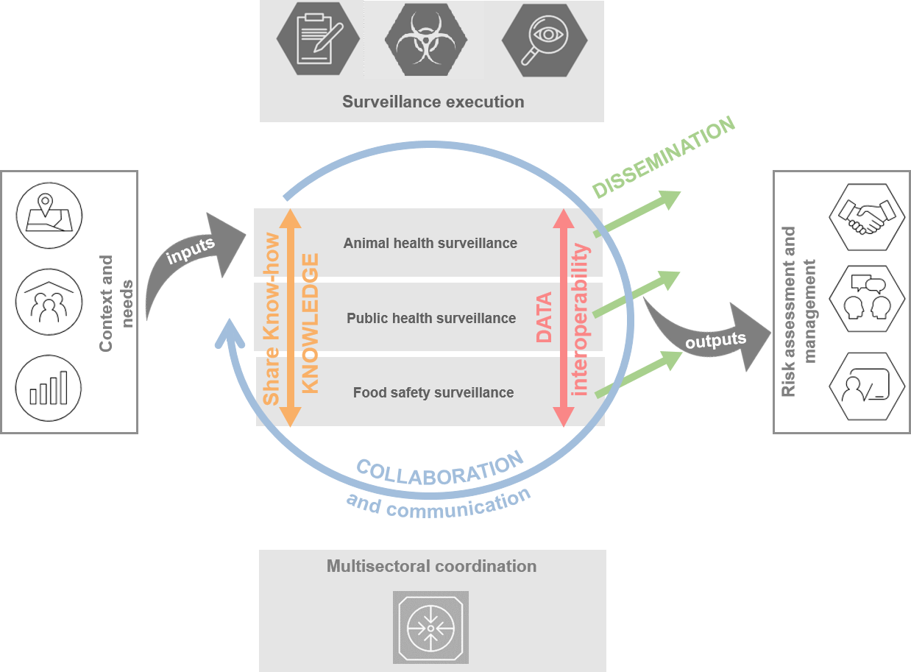
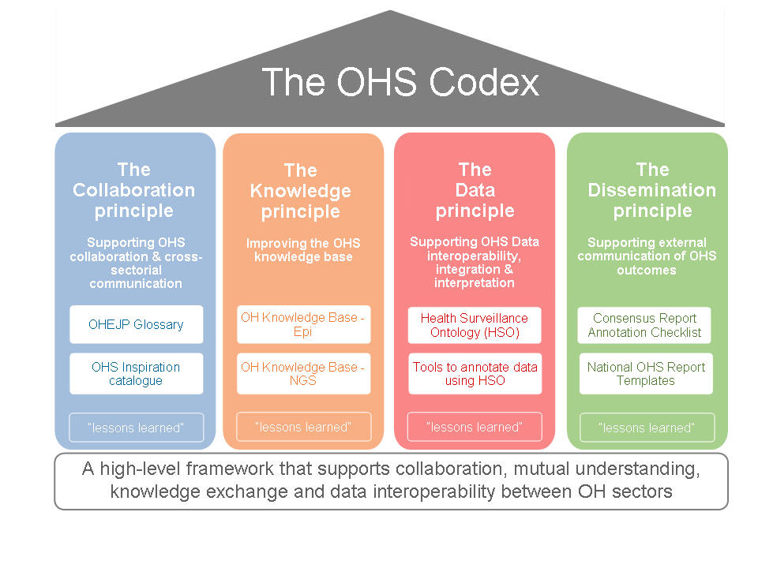
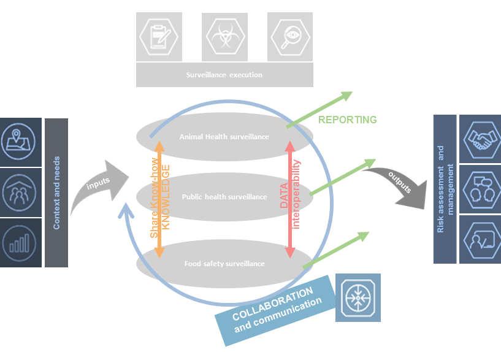
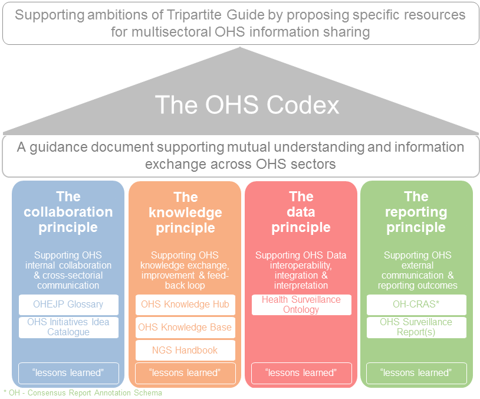

=========================
Introduction / Background
=========================

Zoonoses and antimicrobial resistance (AMR) continue to be significant
impediments to human and animal health and to socioeconomic development
worldwide [1]_, [2]_, [3]_. National and international surveillance
systems and monitoring programmes for zoonoses, zoonotic agents and AMR
are means to combat these impediments. It is generally recognized that
human and animal health are interconnected and that the transmission of
zoonoses and AMR can essentially take place through various links of the
human-animal interface e.g. the environment or food  [4]_, [5]_. This
implies that surveillance cannot be addressed by the human or animal
sector alone, but instead have to be a multisectoral and
multidisciplinary collaboration  [6]_. This approach to collaboration is
referred to as One Health. The benefits and importance of One Health
Surveillance (OHS) are widely accepted, however, there are still
gaps in surveillance or surveillance data that hinder a truly integrated
OHS approach.

Within the EU, EFSA and ECDC have made substantial efforts to harmonize
data collection and reporting within their sectors. These achievements
are important assets for future OHS harmonization efforts, for example
the Data Collection Framework
(`DCF <https://www.efsa.europa.eu/en/supporting/pub/en-444>`__\  [7]_)
and the SIGMA project
(`SIGMA <https://www.efsa.europa.eu/en/supporting/pub/en-1428>`__\  [8]_)
from EFSA, as well as the European Surveillance System
(`TESSy <https://ecdc.europa.eu/en/publications-data/european-surveillance-system-tessy>`__\  [9]_)
from ECDC. Other ongoing joint efforts of these stakeholders support OHS
data harmonization as well, for example the joint molecular typing
database [10]_. Another collaborative effort is the compilation of the
yearly European Summary Reports (EUSRs) on trends and sources of
zoonoses, zoonotic agents and food-borne outbreaks and on antimicrobial
resistance in zoonotic and indicator bacteria from humans, animals and
food (URL: https://www.efsa.europa.eu/en/publications). However, the
current practice of provisioning OHS data in reports could be improved,
specifically when it comes to national or research data not covered by
European legislation. Moreover, no generic strategy for surveillance
data reporting is currently available that could be adopted by all OHS
related scientific disciplines including e.g. environmental science.

The Joint Integrative Project (JIP) “One health suRveillance Initiative
on harmOnization of data collection and interpretatioN” (ORION) aims at
establishing and strengthening inter-institutional collaboration and
transdisciplinary knowledge transfer in the area of One Health
Surveillance (OHS) data integration and interpretation. Detailed
requirement analyses were performed within ORION to identify current
best practices, resources and needs within the OHS community [11]_.
Results from the requirement analyses confirmed that cross-sectoral and
multi-disciplinary communication, collaboration and knowledge exchange
are still significant challenges for the European OHS community. In
addition, the results reinforced the need for better harmonization of
reports on OHS data, which could ultimately lead to improved mutual
understanding and use of sector-specific data in future OH analysis.

This OHS Codex therefore aims at establishing a high-level framework
that supports collaboration, mutual understanding, knowledge exchange
and data interoperability between OH sectors, that will support
integrated OHS data analyses and interpretation.

Purpose
-------

The purpose of this OHS Codex is to provide users with guidance and
resources, e.g. tools, technical solutions, guidance documents, that
improve integrated OHS data analyses and interpretation between the
different OHS sectors. With that the OHS Codex supports the ambitions
outlined in chapter 3, 4, and 5.1 to 5.3 of the FAO, OIE and WHO
document ‘Taking a Multisectoral, One Health Approach: A Tripartite
Guide to Addressing Zoonotic Diseases in Countries” [12]_ (Tripartite
Guide) by proposing specific resources that support putting a true One
Health approach (as described in the Tripartite Guide) into practice in
Europe.

    Fig. 1: Connection between the Tripartite Guide and the four principles of the OHS Codex. 
    The OHS Codex principles and their dimensions are indicated by coloured arrows. The icons correspond to the guiding icons from the Tripartite Guide.

Target community, main stakeholders and organizations
-----------------------------------------------------

According to the understanding of the authors elements of the OHS Codex
will be useful for

organizations or researchers that are involved in

-  One Health surveillance implementation

-  One Health surveillance data reporting

-  One Health data harmonization and standardization

-  Cross-sector risk management

Specifically, this includes

-  the EJP consortium and their follow up organization

-  national authorities in Europe involved in OHS

-  European authorities and institutes, as e.g. EFSA, ECDC, EEA

-  other stakeholders in OHS, as e.g. research organizations

Scope
-----

The scope of the OHS Codex is to provide a framework to embrace
different tools and methods that can enhance OHS data analyses and
interpretation. Currently, it is structured according to four core
principles that were jointly defined by EJP-ORION project members as
critical for achieving this objective. The OHS Codex framework has the
potential to be expanded by more principles in the future in case the
scope / objective is broadened. In this case the OHS Codex could become
a comprehensive hub of tools for OHS improvement.

    Fig. 2: The overview of the OHS Codex framework (figure download as
    pptx-file: https://data.d4science.net/qjZo)

Principles
----------

The OHS Codex framework is structured by four main principles,
identified by ORION as four main areas, where cross-sector understanding
and information exchange could be improved. The Codex describes each
principle and within each provides solutions & methods available to
organisations & researchers, who want to enhance OHS within each
principle. The methods and tools included from the onset in the Codex
were developed and tested within the EJP ORION project. However, the OHS
Codex is designed as an updatable online resource that can be
continuously expanded when new useful methods & solutions become
available.

.. rubric:: References

.. [1]
   “Zoonotic Diseases: Progress Has Stalled.” European Food Safety
   Authority, 12 Dec. 2018, www.efsa.europa.eu/en/press/news/181212.

.. [2]
   “Zoonoses.” World Health Organization, World Health Organization, 19
   July 2017, www.who.int/topics/zoonoses/en/.

.. [3]
   “Antimicrobial Resistance.” World Health Organization, World Health
   Organization,
   www.who.int/en/news-room/fact-sheets/detail/antimicrobial-resistance.

.. [4]
   A European One Health Action Plan against Antimicrobial Resistance

.. [5]
   Taking a Multisectoral, One Health Approach:A Tripartite Guide to
   Addressing Zoonotic Diseases in Countries

.. [6]
   Taking a Multisectoral, One Health Approach:A Tripartite Guide to
   Addressing Zoonotic Diseases in Countries

.. [7]
   https://www.efsa.europa.eu/en/supporting/pub/en-444

.. [8]
   https://www.efsa.europa.eu/en/supporting/pub/en-1428

.. [9]
   https://ecdc.europa.eu/en/publications-data/european-surveillance-system-tessy

.. [10]
   EFSA (European Food Safety Authority), 2014. Technical specifications
   for the pilot on the collection of data on molecular testing of
   food-borne pathogens from food, feed and animal samples. EFSA
   supporting publications 2014;11(12):EN‐712, 58 pp. doi:
   10.2903/sp.efsa.2014.EN-712

.. [11]
   ORION. (2020, April 16). Deliverable-JIP1-D2.3 Report on requirement
   analysis for an "OH Knowledge Base – Integration" (ORION). Zenodo.
   http://doi.org/10.5281/zenodo.3754596

.. [12]
   Taking a Multisectoral, One Health Approach:A Tripartite Guide to
   Addressing Zoonotic Diseases in Countries

