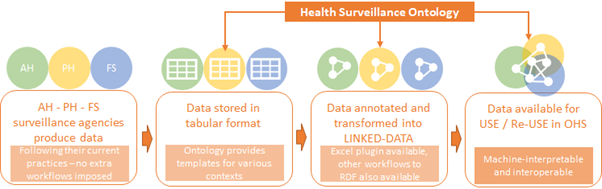

======================================================================================
The Data principle: Supporting OHS Data interoperability, integration & interpretation
======================================================================================

Purpose
-------

The Data principle defines that better surveillance data integration and
interpretation needs tools and guidelines to annotate surveillance
(meta)data so that the surveillance data context is transparent to both
humans (cross-sectorial communication) and machines (interoperability
among data systems). Data and metadata annotation with formal knowledge
representations add value to surveillance data by improving its
usability inside the institutions who own and/or use the data, as well
as improving the potential for reuse in cross-sectoral communication and
decision-making, research, and discovery, all of which are important
components of One Health surveillance.

Scope
-----

The Data principle aims to support cross-sectoral data interoperability
*respecting data provenance* established at the data source. *If* data
will be shared, *how* data will be shared and *who* has access to those
data is the responsibility of data providers. Legal and technical
aspects related to data sharing are beyond the scope of the Data
principle.

Data interoperability is supported under two models of cross-sectoral
cooperation:

1) A single sector produces and analyses data, and annotates the data
      with the relevant context using machine readable knowledge models,
      allowing other sectors to reuse the data.

2) Health sectors work in collaboration to produce information from data
      and support decision-making, analysing data jointly.

Methods
-------

   Data - in particular in a scenario of ever growing data volume,
   velocity and variety - is only useful to support surveillance if it
   can be used to produce information to support decision-making. The
   FAIR data principles (findable, accessible, interoperable and
   reusable) [11]_ aim at “assisting humans and machines in their
   discovery of, access to, integration and analysis of,
   task-appropriate scientific data and their associated algorithms and
   workflows”. *Findability* requires that at the entire dataset or data
   source have sufficiently rich metadata and a unique and persistent
   identifier. *Reusability* is ensured by clear usage licenses and
   accurate information on provenance. These issues are related to the
   way organizations choose to publish their datasets, and their chosen
   model of provenance, and are therefore outside the scope of the OHS
   Codex.

   *Interoperability* relies on (meta)data annotation using a formal,
   accessible, shared, and broadly applicable language for knowledge
   representation. When such knowledge representation is written in
   models understandable to humans *and* machines, *Accessibility* is
   also supported.

   OHS demands several levels of interoperability - among institutions,
   across health surveillance sectors, and among countries.
   Interoperability is used here to mean “the ability of different
   information technology systems and software applications to
   communicate, exchange data, and use the information that has been
   exchanged” [12]_. EFSA and ECDC have done significant work, in their
   respective domains, to solve the problem of **structural
   interoperability** among datasets from different countries. As a
   result, standardised datasets collating surveillance information at
   the European level already exist, and can be accessed through
   different resources made available by these agencies. **Semantic
   interoperability**, on the other hand, is concerned with ensuring the
   integrity and meaning of the data across systems. Semantic
   interoperability is particularly important in OH in order to allow
   data reuse across sectors, and even reuse of data for research and
   knowledge discovery.

   Semantic interoperability is achieved by marking up data and metadata
   using an explicit knowledge model that can be understood by humans
   and by machines, therefore complying with the FAIR principles.

   Resources developed in ORION aimed to support achieving this goal:

1) The development of a FAIR knowledge model for health surveillance

2) Tools for explicit annotation of surveillance data using this model

3) Resources to support the implementation, in practice, of FAIR data
      workflows

**Health Surveillance Ontology (HSO)** 
''''''''''''''''''''''''''''''''''''''

   “\ *An ontology defines a common vocabulary for researchers who need
   to share information in a domain. It includes machine-interpretable
   definitions of basic concepts in the domain and relations among
   them*\ ” [13]_.

   In order to attend the need for a human- and machine-readable
   knowledge model for surveillance, ORION has developed a **Health
   Surveillance Ontology** reusing knowledge from existing ontologies,
   as well as reusing terminologies already commonly used in practice,
   such as those adopted by EFSA and ECDC. Identification of concepts
   and their specialization was informed by data examples from the
   various “OH pilots” carried out in ORION.

   The ontology is publicly available at a globally unique and eternally
   persistent identifier: https://w3id.org/hso. Content management is
   used - humans accessing this link via browser will be referred to a
   page listing all ontology documentation and additional resources,
   such training materials. Software agents pointed to the same address
   will find the machine-readable codes for the knowledge model (written
   using the Web Ontology Language - OWL [14]_).

   The Health Surveillance Ontology is a full FAIR resource.

Tools to annotate data using HSO
''''''''''''''''''''''''''''''''

   As HSO is, on itself, FAIR, it provides the required data annotation
   model for any data source to attend the FAIR principle of
   interoperability, as stated in the data principle I2 (*“To be
   interoperable: I2 (meta)data use vocabularies that follow FAIR
   principles”*).

   The data annotation process is highly dependent on the data
   management tools used at each institution. In ORION we have
   identified that epidemiologists most frequently manipulated and
   exchange in flat formats, in “.xls”, “.xlsx” or “.csv” formats. For
   that reason, we have, in collaboration with other projects, developed
   a tool for semantic annotation of data in Excel, and subsequent
   export of the data in Resource Description Framework (RDF)
   format [15]_, a standard model for data interchange on the Web. The
   Excel plug-in is free and open source. Codes for developers, as well
   as a guide to install the plug-in for users are available at
   https://karlhammar.com/ExcelRDF/.

   Tools to annotate tabular data keeping the tabular format also exist,
   as well as tools to incorporate data annotation into SQL databases.
   Those were not developed in ORION, but their adoption into workflows
   of data production and consumption within OHS practice are supported
   by the workflows examples provided among the ORION resources, as
   listed below.

FAIR data workflows in OHS
''''''''''''''''''''''''''

   Establishing a workflow of data annotation that is sustainable in
   practice must take into account the current practices within the
   agencies involved in OHS. While the adoption of data annotation
   practices can increase the value of data - potentially minimizing
   efforts in other steps of the continuum of data production and
   consumption - it can also be perceived as an “extra-burden”. It is
   important to help institutions understand how to establish effective
   data workflows, incorporating the adoption of the knowledge model
   into their existing practices.

   Data workflows within each ORION OH-pilot will be evaluated to
   propose improvement in FAIRness and incorporation of data annotation
   with minimum change of current practices. These workflows, as well as
   annotated data in various formats, will be made available in the
   ORION Knowledge Hub (https://foodrisklabs.bfr.bund.de/oh-data/ ) to
   serve as inspiration and support to agencies wanting to follow this
   principle. The workflows will exemplify how agencies can improve
   semantic interoperability of their data (in support to OHS) in
   particular, and their data FAIRness in general.

   |image2|

Examples & Lessons learned
--------------------------

   Several ORION project partners carry out national pilot studies to
   test methods from the Data principle regarding usability within a
   cross sectional approach. Findings from these pilot studies will be
   reported here.

.. rubric:: Reference

.. [11]
   Findable, Accessible, Interoperable, Reusable.
   https://www.force11.org/group/fairgroup/fairprinciples

.. [12]
   HIMSS Dictionary of Healthcare Information Technology Terms, Acronyms
   and Organizations, 2nd Edition, 2010, Appendix B, p190

.. [13]
   Natalya F. Noy and Deborah L. Mcguinness. 2001. Ontology Development
   101: A Guide to Creating Your First Ontology. Available at
   http://protege.stanford.edu/publications/ontology\_development/ontology101.pdf

.. [14]
   https://www.w3.org/OWL/

.. [15]
   https://www.w3.org/RDF/

