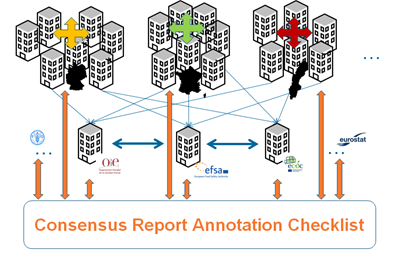

==========================================================================
The Dissemination principle: Supporting external communication of OHS outcomes
==========================================================================

Purpose
-------

The dissemination principle defines that better surveillance data
integration and interpretation needs improved cross-sectorial OHS report
integration and harmonization. The resources provided within this
principle are meant to support the cross-sectorial harmonized
provisioning of metadata in OHS reports and e.g. to provide a foundation
for advice to risk managers. Best practice examples illustrate how the
reporting of surveillance outputs using new checklists and templates
relying on cross-sectoral analysis of surveillance outputs, will improve
the value for all stakeholders. It also demonstrates that such
activities support the cross-sectorial understanding of contextual
information in future OHS reports.

Scope
-----

The resources provided within this principle are directed towards the
activities linked to report generation or dissemination of surveillance
data and results. Proposed solutions were designed to be generically
applicable for any surveillance activity in all OH sectors, including
those that were not directly involved in their development e.g. the
environmental sector. In addition they should be applicable to all
European countries, geographic areas and administrative levels.

Methods
-------

One Health Consensus Report Annotation Checklist (OH-CRAC)
''''''''''''''''''''''''''''''''''''''''''''

   To achieve OHS report harmonization we are proposing the
   establishment and adoption of a so-called **“One Health Consensus Report
   Annotation Checklist” (OH-CRAC)**. The adoption of OH-CRAC will allow all
   existing OHS metadata to be mapped to one concurrent metadata schema,
   instead of cross-mapping metadata between several sectoral and
   institutional metadata systems as illustrated in Figure 3. The
   implementation and comprehension of the OH-CRAC will thereby cause
   minimal efforts for all involved parties. OH-CRAC is also available
   as an interactive online tool that allows the provisioning of
   surveillance meta-information in an easy and user-friendly manner

   Link: https://aflex.vrac.iastate.edu/checklist/?t=OH-CRAC

   
    Fig. 3: Schematic drawing of OH-CRAC that is proposed to map and structure
    metadata in OH surveillance reports. Orange arrows indicate the mapping
    of metadata from federal/national systems (top) and
    European/international stakeholders (bottom) systems to the proposed
    OH-CRAC.

National OHS Report Templates
'''''''''''''''''''''''''''''
   Surveillance of zoonoses and AMR is often carried out in multiple
   animal species, foods and/or people and reported separately.
   Sometimes, outputs from different sectors are reported in the same
   report or in the same chapters, but usually every author/sector
   provides their own text and graphics. This tends to present the
   providers’ perspective rather than focussing on the receiver needs
   and may not interpret the data from a One Health perspective. To
   support One Health reporting, examples or templates to report
   different types of hazards with a OH focus have been developed. The
   templates demonstrate how to report e.g. AMR in food borne zoonoses
   throughout the food chain and focusing on the consequences for humans
   and animals or how to report zoonotic trends, whilst enhancing the
   One Health focus.

   Template to report AMR in Campylobacter in animals, meat and humans
   from a One Health perspective:

   Example:
   https://www.danmap.org/-/media/arkiv/projekt-sites/danmap/danmap-reports/danmap-2018/danmap_2018.pdf?la=en

Examples & Lessons learned
--------------------------

   Several ORION project partners carry out national pilot studies to
   test the Dissemination principles within a cross sectional approach.
   Findings from these pilot studies will be reported here.

